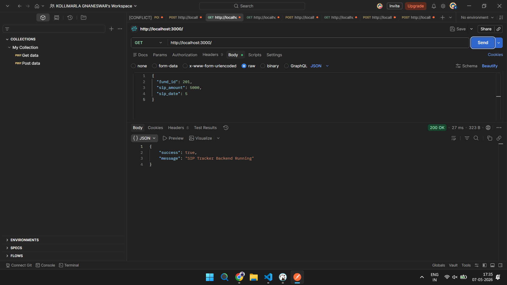
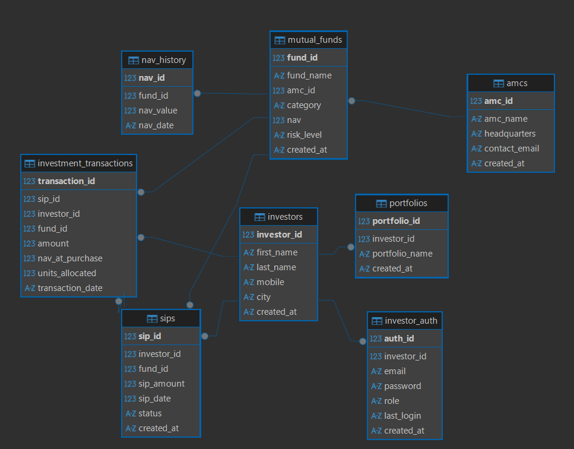

# SIP Tracker & Portfolio Valuation System

A fintech backend application built using Node.js, Express.js, and SQLite for managing SIPs (Systematic Investment Plans), portfolio valuation, mutual funds, and investment transaction tracking.

---

# Features

- Investor Management
- JWT Authentication & Authorization
- Mutual Fund Management
- AMC Management
- SIP Registration
- SIP Installment Processing
- Investment Transaction Tracking
- Portfolio Holdings Calculation
- Net Worth Calculation
- NAV History Tracking
- SQLite Transaction Handling
- Role-Based Access Control
- Protected APIs

---

# Tech Stack

- Node.js
- Express.js
- SQLite
- JWT
- bcrypt
- REST APIs

---

# Database Design

Normalized relational schema (3NF) with:

- investors
- investor_auth
- portfolios
- amcs
- mutual_funds
- nav_history
- sips
- investment_transactions

---

# Authentication Flow

- User Registration
- Password Hashing using bcrypt
- JWT Token Generation
- Protected APIs using Middleware
- Role-Based Authorization

---

# API Endpoints

## Auth APIs

| Method | Endpoint |
|---|---|
| POST | /api/auth/register |
| POST | /api/auth/login |

---

## Investor APIs

| Method | Endpoint |
|---|---|
| GET | /api/investors/:investorId |
| GET | /api/investors/:investorId/holdings |
| GET | /api/investors/:investorId/networth |

---

## Fund APIs

| Method | Endpoint |
|---|---|
| POST | /api/funds |
| GET | /api/funds |
| PUT | /api/funds/:fundId/nav |

---

## SIP APIs

| Method | Endpoint |
|---|---|
| POST | /api/sips |
| GET | /api/sips/:sipId |
| POST | /api/sips/:sipId/process |
| GET | /api/sips/:sipId/transactions |

---

# Transaction Handling

Implemented transaction-safe operations using:

```sql
BEGIN TRANSACTION
COMMIT
ROLLBACK
```

Used in:

- User Registration
- SIP Processing
- NAV Updates

---

# Setup Instructions

## Clone Repository

```bash
git clone https://github.com/gnaneswar9676/sip-tracker-backend.git
```

---

## Install Dependencies

```bash
npm install
```

---

## Create .env File

```env
PORT=3000
JWT_SECRET=your_secret_key
```

---

## Start Server

```bash
nodemon server.js
```

---

# Project Structure

```txt
backend/
│
├── controllers/
├── routes/
├── middleware/
├── utility/
├── database/
├── screenshots/
├── server.js
├── package.json
└── README.md
```

---

# Postman API Testing

## 1. Health Check API



---

## 2. Register API


---

## 3. Login API


---

## 4. Get Funds API


---

## 5. Create Fund API


---

## 6. Update NAV API


---

## 7. Create SIP API


---

## 8. Get SIP API


---

## 9. Process SIP API


---

## 10. SIP Transactions API


---

## 11. Holdings API


---

## 12. Networth API


---

## 13. Authorization API


---

## 14. ER Diagram



---

# Security Features

- JWT Authentication
- Password Hashing using bcrypt
- Protected Routes
- Investor Ownership Validation
- Role-Based Authorization

---

# Future Improvements

- Swagger Documentation
- Admin Role
- Cron-based SIP Auto Processing
- Docker Deployment
- Unit Testing
- Email Notifications

---

# Author

Gnaneswar K
